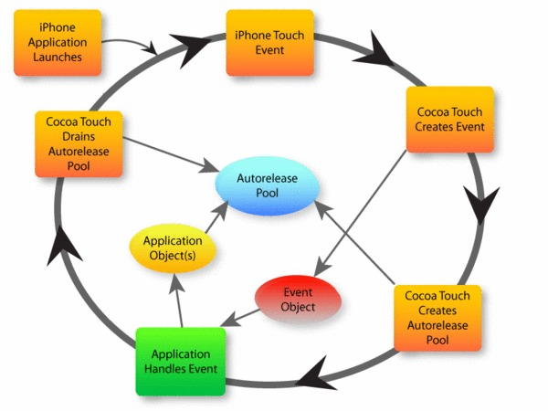

# RunLoop应用

## 自动释放池
* 作用

    * 自动释放对象的
    * 所有 `autorelease` 的对象，在出了作用域之后，会被自动添加到`最近创建的`自动释放池中
    * 自动释放池被销毁或者耗尽时，会向池中所有对象发送 `release` 消息，释放池中对象
    * 自动释放池，在 `ARC` & `MRC` 程序中，同样有效




App启动后，苹果在主线程 RunLoop 里注册了两个 Observer管理和维护AutoreleasePool，其回调都是 _wrapRunLoopWithAutoreleasePoolHandler()，打印currentRunLoop可以看到。

```c
<CFRunLoopObserver 0x6080001246a0 [0x101f81df0]>{valid = Yes, activities = 0x1, repeats = Yes, order = -2147483647, callout = _wrapRunLoopWithAutoreleasePoolHandler (0x1020e07ce), context = <CFArray 0x60800004cae0 [0x101f81df0]>{type = mutable-small, count = 0, values = ()}}
<CFRunLoopObserver 0x608000124420 [0x101f81df0]>{valid = Yes, activities = 0xa0, repeats = Yes, order = 2147483647, callout = _wrapRunLoopWithAutoreleasePoolHandler (0x1020e07ce), context = <CFArray 0x60800004cae0 [0x101f81df0]>{type = mutable-small, count = 0, values = ()}}
```

- 第一个 Observer 监视的事件是 Entry(即将进入Loop)，其回调内会调用 _objc_autoreleasePoolPush() 创建自动释放池。其 order 是-2147483647，优先级最高，保证创建释放池发生在其他所有回调之前。

- 第二个 Observer 监视了两个事件，这个 Observer 的 order 是 2147483647，优先级最低，保证其释放池子发生在其他所有回调之后： 
    - BeforeWaiting(准备进入休眠)时调用`_objc_autoreleasePoolPop()` 和 `_objc_autoreleasePoolPush()` 释放旧的池并创建新池；
    - Exit(即将退出Loop) 时调用 _objc_autoreleasePoolPop() 来释放自动释放池。
       
主线程的其他操作通常均在这个AutoreleasePool之内（main函数中），以尽可能减少内存维护操作(当然你如果需要显式释放【例如循环】时可以自己创建AutoreleasePool否则一般不需要自己创建)。

### 常见面试题：

1. 自动释放池是什么时候创建的？什么时候销毁的？

    * 创建，运行循环检测到事件并启动后，就会创建自动释放池
    * 销毁：一次完整的运行循环结束之前，会被销毁

* 提问：以上代码是否有问题？如果有，如何解决？
```objc
for (long i = 0; i < largeNumber; ++i) {
    NSString *str = [NSString stringWithFormat:@"hello - %ld", i];
    str = [str uppercaseString];
    str = [str stringByAppendingString:@" - world"];
}
```

* 解决方法：引入自动释放池
    * 1> 外面加自动释放池（快）：能够保证for循环结束后，内部产生的自动释放对象，都会被销毁
需要等到 for 结束后，才会释放内存
    * 2> 里面加自动释放池（慢）：能够每一次 for 都释放产生的自动释放对象！

```objc
- (void)touchesBegan:(NSSet *)touches withEvent:(UIEvent *)event {

    NSLog(@"start");
    CFAbsoluteTime start = CFAbsoluteTimeGetCurrent();
    [self answer1];
    NSLog(@"外 %f", CFAbsoluteTimeGetCurrent() - start);

    start = CFAbsoluteTimeGetCurrent();
    [self answer2];
    NSLog(@"内 %f", CFAbsoluteTimeGetCurrent() - start);
}

- (void)answer1 {
    @autoreleasepool {
        for (long i = 0; i < largeNumber; ++i) {
            NSString *str = [NSString stringWithFormat:@"hello - %ld", i];
            str = [str uppercaseString];
            str = [str stringByAppendingString:@" - world"];
        }
    }
}

- (void)answer2 {
    for (long i = 0; i < largeNumber; ++i) {
        @autoreleasepool {
            NSString *str = [NSString stringWithFormat:@"hello - %ld", i];
            str = [str uppercaseString];
            str = [str stringByAppendingString:@" - world"];
        }
    }
}
```

* 实际测试结果，是运行循环放在内部的速度更快！
* 日常开发中，如果遇到局部代码内存峰值很高，可以引入运行循环及时释放延迟释放对象
